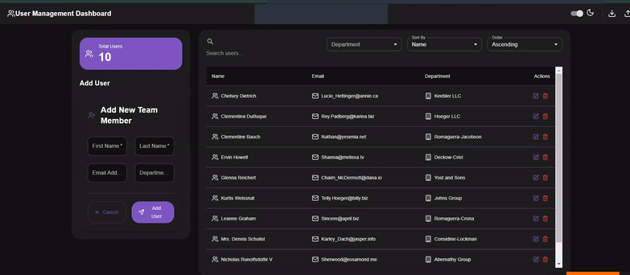

# User Management Dashboard  [](https://ajackus-seven.vercel.app/)
## 🌐 Live Demo

Experience the application live at [https://ajackus-seven.vercel.app/](https://ajackus-seven.vercel.app/)
## A modern, feature-rich user management dashboard built with React that allows viewing, adding, editing, and deleting user details with a mock backend API.



## 🌟 Features

### Core Functionality
- **CRUD Operations**: View, add, edit, and delete user details
- **Data Display**: Shows user ID, First Name, Last Name, Email, and Department
- **Error Handling**: Robust error management for API failures
- **Form Validation**: Client-side validation for user inputs

### Enhanced Features
- **Data Import/Export**
  - Import users from Excel files
  - Export user data to Excel format
- **Theme Support**
  - Dark mode
  - Light mode
- **User Statistics**
  - Total users count
  - Department-wise distribution
- **Advanced UI Features**
  - Infinite scrolling
  - Responsive design
  - Interactive user cards

## 🚀 Getting Started

### Prerequisites
- Node.js (v14 or higher)
- npm or yarn
- Docker (optional)

### Installation

1. **Clone the repository**
```bash
git clone https://github.com/Shashankpantiitbhilai/Ajackus
cd user-management-dashboard
```

2. **Set up environment variables**
```bash
cp .env.example .env
```
Update `REACT_APP_BACKEND_BASEURL` in `.env` with information in the .env.example file

3. **Install dependencies**
```bash
npm install
```

### Running the Application

#### Method 1: Using npm
```bash
npm start
```
Visit `http://localhost:3000` in your browser


## 📁 Project Structure
```
Directory structure:
└── shashankpantiitbhilai-ajackus/
    ├── README.md
    ├── docker-compose.yml
    ├── dockerfile
    ├── package.json
    ├── .env.example
    ├── public/
    │   ├── index.html
    │   ├── manifest.json
    │   └── robots.txt
    └── src/
        ├── App.css
        ├── App.js
        ├── App.test.js
        ├── index.css
        ├── index.js
        ├── components/
        │   ├── Dashboard.jsx
        │   ├── DeleteDialog.jsx
        │   ├── DetailForm.jsx
        │   ├── FilterSearch.jsx
        │   ├── PersonCard.jsx
        │   ├── Scroller.jsx
        │   ├── SearchBar.jsx
        │   ├── Theme.jsx
        │   └── UserManagement.jsx
        ├── services/
        │   ├── fetchUsers.js
        │   ├── initialLoad.js
        │   └── paginationService.js
        ├── style/
        │   └── Dashboard.css
        └── utils/
            ├── ColorUtils.js
            ├── SearchHandler.js
            └── nameUtils.js
```

## 🛠 Development Commands

- **Start Development Server**
  ```bash
  npm start
  ```

- **Run Tests**
  ```bash
  npm test
  ```

- **Create Production Build**
  ```bash
  npm run build
  ```

## ⚠️ Troubleshooting

- If the application shows only a loader:
  - Try switching your network connection
  - Check if the API endpoint is accessible
  - Verify your `.env` configuration

## 🎯 Project Objectives Met

1. **User Interface Requirements**
   - ✅ Complete CRUD functionality
   - ✅ Responsive design
   - ✅ Interactive user interface

2. **Backend Integration**
   - ✅ JSONPlaceholder API integration
   - ✅ Robust error handling
   - ✅ Mock data management

3. **Additional Features**
   - ✅ Excel import/export
   - ✅ Theme switching
   - ✅ Infinite scrolling
   - ✅ User statistics


## 💭 Development Reflections
During the development process, several key challenges were tackled by me :

- **Responsive Design**: Implemented adaptive layouts using CSS Grid and Flexbox for seamless viewing across devices
- **Pagination**: Created custom infinite scroll with optimized performance and position memory
- **Excel Integration**: Developed robust import/export functionality with data validation and progress tracking

## 🔮 Future Improvements
1. **Backend Enhancement**
   - Express.js server implementation
   - MongoDB integration
   - Real-time updates with WebSocket

2. **Authentication**
   - JWT-based authentication
   - Role-based access control
   - OAuth2.0 social login

3. **AI Features**
   - Natural language search
   - Smart analytics
   - Automated insights

4. **UX Improvements**
   - Customizable dashboards
   - Bulk operations
   - Advanced filtering

5. **Performance**
   - Server-side pagination
   - Redis caching
   - Data compression

## 📝 Notes

- The application uses JSONPlaceholder for demonstration purposes
- All CRUD operations are simulated
- The app is optimized for both desktop and mobile views.
  